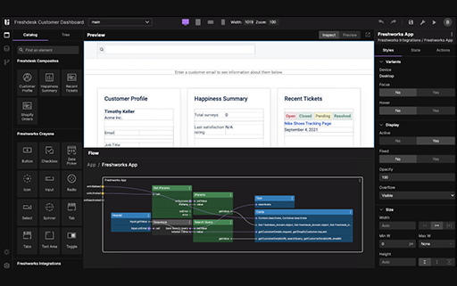
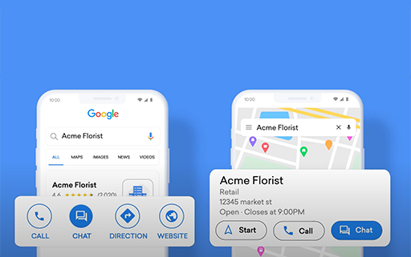

# Welcome

Welcome dear reader,

> The document has been prepared as part of assignment as part of Developer Advocate evaluation process conducted by Freshworks. Please refer to items below to know more   -> [Assignment case study](related-articles/case-study.md)   -> [Solutioning approach and thoughtprocess](related-articles/thought-process.md)

[Freshwork](background/About.md), We are a leading provider of modern SaaS solutions that solve multiple, complex business problems to companies of all sizes. Businesses from more than 120 countries around the world use Freshworks’ products to delight their customers and employees every day. 

We aspire to be one of the most loved companies in the world

### Delight made easy.

Freshworks makes it fast and easy for businesses to delight their customers and employees. We take a fresh approach to how businesses discover, engage with, and realize value from software throughout their journey.

### Our products

- [Freshdesk](https://freshdesk.com)
- [Freshsales](https://www.freshworks.com/crm/sales/)
- [Freshmarketer](https://www.freshworks.com/crm/marketing/)
- [Freshservice](https://freshservice.com/)
- [Freshteam](https://www.freshworks.com/hrms/)

### Whats new?

This section details the latet features and releases that were made. The complete list of all the available features can be found under [release notes](release-notes/release-note.md). Click on each image icon to know more.

 ECMAScript2017 Application Support|  low code support |  Google business messages integration | [more](releases/release-note.md).
---------|----------|----------|----------

You can read more about the features and latest releases at [Freshworks Neo](https://www.freshworks.com/neo-news/#)

> Additional links
> - [Blogs](https://www.freshworks.com/blogs/)
> - [Academy](https://www.freshworks.com/academy/)
> - [Community](https://community.freshworks.com/)