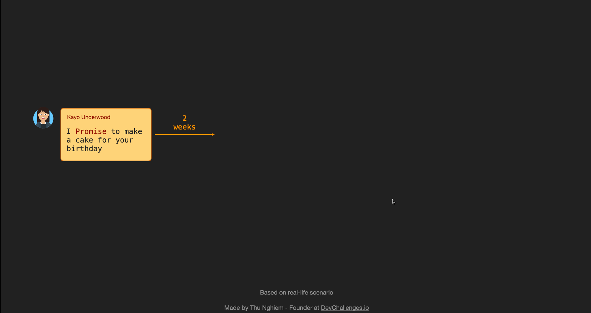

# Javascript Async Functions


By Default Javascript is a Synchronous, which means that it has an event loop that allows you to queue up an action that won’t take place until the loop is available sometime after the code that queued the action has finished executing. However, it changed after ECMAScript2017, with introduction of JavaScript Async Functions. To understand this better lets understand few concepts first.

## JavaScript | Promises

Promises are used to handle asynchronous operations in JavaScript. They are easy to manage when dealing with multiple asynchronous operations where callbacks can create callback hell leading to unmanageable code. 



Prior to promises events and callback functions were used but they had limited functionalities and created unmanageable code. 
Multiple callback functions would create callback hell that leads to unmanageable code. Also it is not easy for any user to handle multiple callbacks at the same time.
Events were not good at handling asynchronous operations.

Promises are the ideal choice for handling asynchronous operations in the simplest manner. They can handle multiple asynchronous operations easily and provide better error handling than callbacks and events. In other words also, we may say that, promises are the ideal choice for handling multiple callbacks at the same time, thus avoiding the undesired callback hell situation. Promises do provide a better chance to a user to read the code in a more effective and efficient manner especially it that particular code is used for implementing multiple asynchronous operations. 

### Benefits of Promises

- Improves Code Readability
- Better handling of asynchronous operations
- Better flow of control definition in asynchronous logic
- Better Error Handling

### Promise states 

- **fulfilled**: Action related to the promise succeeded
- **rejected**: Action related to the promise failed
- **pending**: Promise is still pending i.e. not fulfilled or rejected yet
- **settled**: Promise has fulfilled or rejected


A promise can be created using Promise constructor.

Syntax
```json
var promise = new Promise(function(resolve, reject){
     //do something
});
```

### Parameters 
- Promise constructor takes only one argument which is a callback function (and that callback function is also referred as anonymous function too).
- Callback function takes two arguments, resolve and reject
- Perform operations inside the callback function and if everything went well then call resolve.
- If desired operations do not go well then call reject.

Example
```json

var promise = new Promise(function(resolve, reject) {
  const x = "helloEcma";
  const y = "helloEcma"
  if(x === y) {
    resolve();
  } else {
    reject();
  }
});
   
promise.
    then(function () {
        console.log('Success, You are into promise');
    }).
    catch(function () {
        console.log('Some error has occurred');
    });
```


Output

```json
Success, You are into promise
```

> You can read further on usage and syntax of promise [here](https://www.geeksforgeeks.org/javascript-promises/). 
> Additionally you may refer to [JSInfo](https://javascript.info/async-await)
