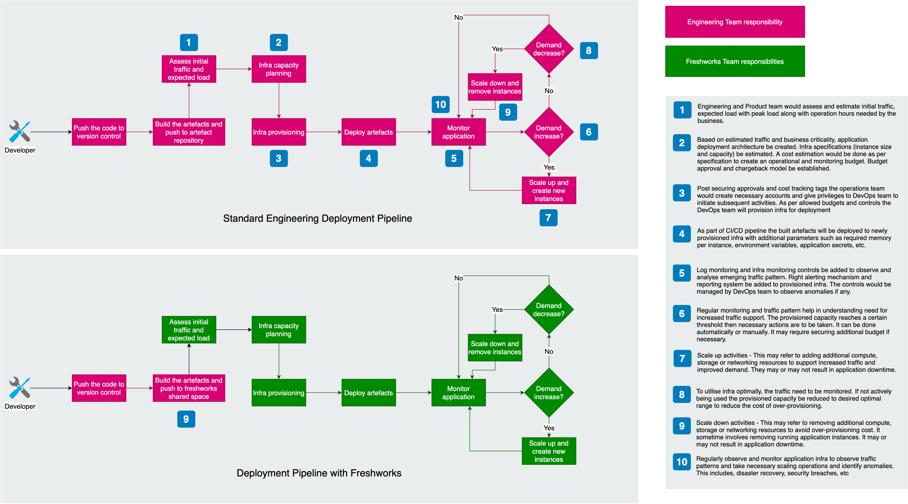

# Release notes

Release notes are documents that are shared with end users, customers and clients of an organization. The definition of the terms 'End Users', 'Clients' and 'Customers' are very relative in nature and might have various interpretations based on the specific context. For instance, the Quality Assurance group within a software development organization can be interpreted as an internal customer.

Below section entails the latest features that have been incorporated as part of our release process.


### Bundles Application Deployment Support

We offer an easy-to-use service for deploying and scaling web applications and services developed using Javascript without developers having to worry about deployments or scaling or maintenance of infrastructure. You can simply upload your application code bundle on our platform through allowed upload means, and we will automatically handle the deployment. It includes capacity provisioning, load balancing, auto-scaling to application health monitoring and other useful parameters monitoring.

By uaing this feature developers would gain following benefits
- **Fast and simple to begin** - It is fastest and simplest way to deploy your application on our platform.
- **Developer productivity** - we provision and operate the infrastructure and manage the application stack (platform) for you, so you don't have to spend the time or develop the expertise.
- **Easy scaling** - We automatically scale our platform up and down based on your application's specific need
- **Easy maintenance** - you can focus on writing code rather than spending time managing and configuring servers, databases, load balancers, firewalls, and networks.



### ECMAScript 2017 Support

As of our [latest spring release](latest-release), support for [ECMAScript 2017](../background/JS-introduction.md) has been added. This allows developers to write application using [**Async/Await**](../background/JS-async-functions.md) method.

By Default Javascript is a Synchronous, which means that it has an event loop that allows you to queue up an action that won’t take place until the loop is available sometime after the code that queued the action has finished executing. However, it changed after ECMAScript2017, with introduction of JavaScript Async Functions.


#### **Async**
It simply allows us to write promises based code as if it was synchronous and it checks that we are not breaking the execution thread. It operates asynchronously via the event-loop. Async functions will always return a value. It makes sure that a promise is returned and if it is not returned then javascript automatically wraps it in a promise which is resolved with its value.

**Example**

```json
const getData = async() => {
    var data = "Hello World";
    return data;
}
  
getData().then(data => console.log(data));
```
**Output**

```json
Hello World

```
#### **Await**

Await function is used to wait for the promise. It could be used within the async block only. It makes the code wait until the promise returns a result. It only makes the async block wait.

**Example**

```json

const getData = async() => {
    var y = await "Hello World";
    console.log(y);
}
  
console.log(1);
getData();
console.log(2);
```
**Output**
```json
1
2
Hello World
```

Notice that the console prints 2 before the “Hello World”. This is due to the usage of the await keyword.

